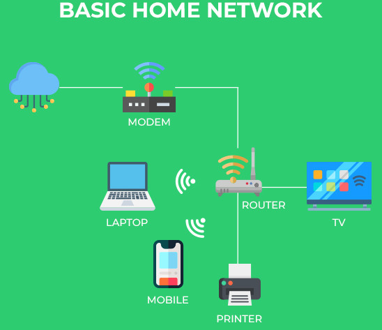

# Protecting Your Personal Computer

### More Than Install an Anti-Virus Application
I am starting out with information about protecting your Personal Computer, not because it is what you might use the most often, but because the concepts for protecting this computer will be much simpler than the concepts for protecting your Smart Phone - but we will get there in future classes.

### History of Connectivity
In the early 1980's, most computers in American households were not on the internet, or at least, they were not connected for very long.  Internet connectivity was a paid service, and the speed at which we connected, prevented us from being connected 24/7, and, there just weren't enough services where we could've spent that many hours.  During this period of time, Cyber-Security and hacking were happening, but on a very small scale, not for profit, and usually the target was some sort of governmental agency.

Today, our connections are 24/7, and very, very fast.  This enables anyone in the world, to attempt to connect to any server, website, or home computer in the world.  This massive increase in targets has enabled large numbers of people/groups to spend much time online, learning, practicing, and attempting to break into anything attached to the internet.  These attacks can take many forms, and for various motives.  Also, as spying between governments has evolved, the internet has played a large role in gathering information about enemies, allies, and their citizens.  This surveillance has grown in scope within the United States to include it's own citizens.  The NSA has agreements with most communications, and tech. companies to scan, collect, and save most of the SMS/Text messages, emails, and phone records for every communication within the United States, and many of the countries around the world.  The logic for such a large surveillance system is to protect the United States from enemies within, and abroad.  The danger is that with much power, comes much responsibility.  Our government hasn't shown itself to handle responsibility of this information, or power, very well - especially in that past few years.

### Home Network / Computer

I'm sure most of you are not currently on the NSA's radar (yet), but every American is seen as wealthy by the citizens, and groups, of most every other nation in the world: making us the target of phishing and hacking, in order to gain access to bank accounts, or to hold data hostage, until a ransom is paid.

Whether your home computer is a Desktop, or a Laptop, and whether your operating system is Windows, OS/X (Apple), or something else (Linux), these list below will go along way to protecting you from getting hacked, or tracked online:

- Make certain to keep your operating system current (download and install updates, reboot when they are applied)
- Make certain the firewall on your modem and router is enabled, and running the most current software
- Protect your personal data (browsing history, preferences, likes/dislikes) by using the correct browser and search engine (with the proper settings)
- Be careful and wise about the links you click on (especially ones in your email)
- Choose strong passwords (unique to each website), and enabl 2-Factor Authentication (2FA) whenever a site supports that (preferably not via SMS/TXT messaging)
- Create backups of important data (preferably stored in a fireproof box, or a location other than where the original data is located)

### Firewall / Modem
This is your first line of defense.  In order to keep the direct attacks from the internet outside of your house, this needs to be enabled, and configured properly.  Often, there isn't anything you can do here, as this hardware is owned by your internet service provider.  They rent it to you, and are responsible for configuring it, and keeping the settings/software updated.  You should contact your internet service provider to find out what their policies/procedures are regarding security updates, and how they are protecting you.

If you do have access to make configuration changes, another item that you can do to protect yourself in your home is to change your DNS (Domain Name System) settings to request the addresses of internet websites/domains from a location that aims to protect you from known dangerous/bad/unsafe servers/websites.  To learn more about your options for DNS settings, see this [additional resource](dns.md) .  If you do not have access to make configuration changes to your Firewall / Modem, you can still use this information to change your DNS settings, but you will have to change it on every device separately, not just on the main device.

### Keeping Your Operating System Current
Like the Firewall / Modem above, you don't have too much control over this one either, except to make certain it is enabled to receive automatic updates, and that you allow those to be applied, and reboot after they are:

- Windows 10 ( [Detailed Instructions](https://www.tech-recipes.com/rx/69127/how-to-turn-on-and-off-automatic-updates-in-windows-10) )
- OS/X ( [Detailed Instructions](https://osxdaily.com/2019/04/11/enable-auto-update-macos-system-software) )

Over the next several classes, we will examine the other items which you can/should do to protect your Personal Computer.

<--[Introduction](../README.md)  [Next Class](../Class2/README.md)

Additional Reading:
[Further_Reading](Further_reading.md)
