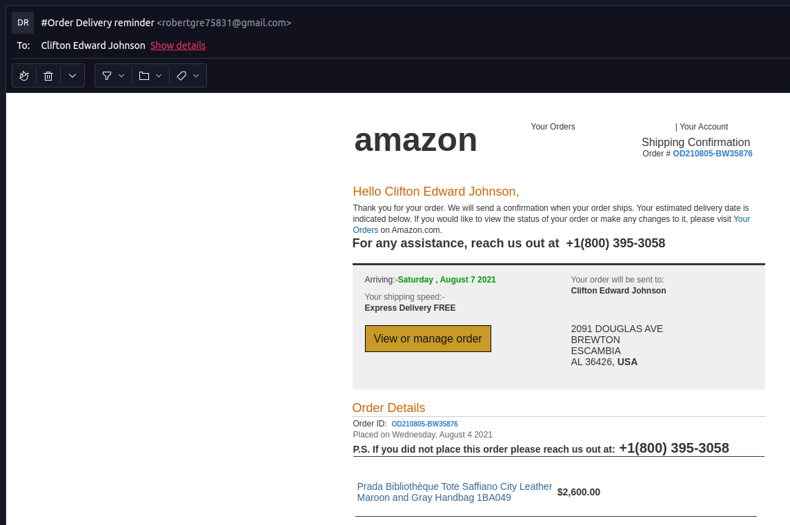

# Securing E-Mail Communications

### Brief History of E-Mail
E-mail is one of the first forms of communication on the internet (the first email was sent in 1971).  E-mail is very insecure, and not much has been changed in the technology to change that.  When you type and e-mail, and click Send, your words are stored (as text) in your Sent folder, and a copy is handed to the e-mail server, who then does a query of the DNS server to know where to find the person you are sending it to.  A connection is made from that e-mail server, to the e-mail server the person you writing to is using, and the message (again, as text), is copied to their e-mail server, and stored (as text) on that server, until your intended recipient connects and retrieves it (as text).

### Why the Emphasis on "as text"
As an e-mail travels from server to server, and person to person, that message can be captured, copied, read, forwarded, etc.  A good rule of thumb, when writing an e-mail message, is to not write anything that you wouldn't want read by the entire world.  Most of us don't share secrets over e-mail, and so, aren't worried about it.  But, sometimes we forget that the message is readable by the world, and when a spouse sends a quick e-mail, or SMS/TXT (which is also transmitted as text, needing your Health Insurance member number, your Social Security number, etc., and you respond without thinking about it (since it is your spouse), you may have just opened yourself up to any number of evils: Identity Theft, Banking Theft, etc. - depending on the information shared.

### Solutions?
Even though e-mail is nearly a 50 year old technology, and there many other forms of communication, we continue to use e-mail for many things.  There are tools which allow for encrypting messages, prior to sending, and this requires extra software for the sender, the receiver, and a sharing of public keys between each sender and receiver combination.  Another solution, is to switch e-mail providers to a service which stores all of your e-mail in an encrypted state (incoming new e-mail, sent-mail, archived email - all of it).  The only person who can read your e-mail is you.  One such service is called [Protonmail.com](https://protonmail.com) . Protonmail is an e-mail server that has encryption built-in (no extra software needed, and they generate your encryption keys for you).  The only downside to a service like this: if you want to send an encrypted message to anyone not on the Protonmail server, they will need your public key in order to read it.  Solution:  Everyone should get a Protonmail.com account!

Even if you don't replace your primary e-mail with the Protonmail account, at least you have the option when you would like to send securely encrypted and stored messages.

### Phishing
While we are on the subject of e-mail, we should discuss "phishing".  Phising, is much like "going fishing".  Someone who wants information only you have (like, bank account login credentials, or shopping sites which might already your credit card saved), will send you an e-mail, crafted to trick you into clicking on a link, and typing in the information they are looking for.

Here is a rather convincing Phishing e-mail I received recently:

This e-mail appears, at first, to be a receipt from Amazon for an order I supposedly placed.  The Phisher, wanted me to believe that my account with Amazon had been compromised, and click on the "View or manage order" button.  If I hadn't noticed that this wasn't an e-mail from Amazon, I might have clicked that button (or in fishing terms, taken the bait).  Most likely, the button would have opened up a web page on my browser, and that page would've looked like a login page for Amazon, and if I had typed in my login information, it wouldn't have logged me into Amazon, but most likely given an error, and I would have tried over and over, giving up, and trying a different way (as I would've been frantic to cancel the $2600.00 order).  In the background, that "fake" Amazon login page was sending my username and password to the person/group who sent the Phising e-mail, and they would login to Amazon as me, change my password (so that I couldn't log in and make any changes), and then hope that a credit card was attached, and then proceed to order whatever they pleased, having the items shipped to them, instead of me, and leaving me with the bill (and frustration of fighting the charges, getting a new credit card, etc.).

Now, it is possible, the Phisher wouldn't have had it quite that easy.  I'm sure you've been prompted, and required, for websites, like banks, Amazon, etc. to add an extra step of security to your account.  This is called 2FA (2-Factor Authentication).  The idea behind 2FA authentication is that if someone obtains your username and password, there needs a 3rd item (which should be in your physial possession)

### Why it Matters?

<<-- [Previous Class](../Class2/README.md) -- [Next Class](../Class4/README.md) -->>

Additional Reading:
[Further_Reading](Further_reading.md)
