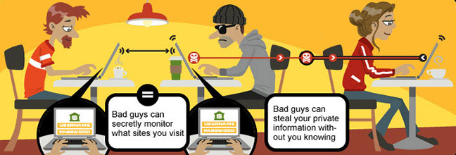

# The Convenience, and Dangers, of WiFi

### WiFi
Wifi:  We all use it.  It has changed the way we go online, and enables us to be online continually (for better, or worse).  When we are at home, airport, hotel, amusement park, restaurant, airplane, and even the dentist office.  We believe we can't miss out on that important e-mail, Social Media post, or news event, so we insist on being connected whenever, and wherever, we are.

But what is WiFi?  WiFi basically means wireless, which is electronic communication, transmitted via radio waves, through the air, instead of through physically connected wires.  And that's why it is so popular; we no longer have to find a network cable, and network port, to plug our laptops into (when is the last time you could even find a network port in an airport, or hotel?).  

### Dangers
This extra convenience, and ease of use, makes the use of WiFi networks more dangerous: especially in crowded, public places, that offer free Wifi.  

Why?  The radio signals, transmitted through the air, from the WiFi Hotspot that the Coffee shop has setup for customers to use (and plastered the password everywhere, for everyone, to see), are not travelling in a straight line from your computer, to their hotspot, but, are being broadcast out via the radio antennas, in all directions, for upwards of 50 feet.  This means, that the data that travels from your cell phone app, or your laptops browser, to the WiFi Hotspot, can be "seen" by all of the other electronic equipment within that 50 foot radius.  That means, that a person who was in the coffee shop yesterday, and connected to the free WiFi Hotspot, can come back today, sit in their car, in the parking lot, and use their laptop to see/collect all of the data that is being transmitted on that free WiFi Hotspot.

Also, when you connect to a WiFi Hotspot, you connect to it by the "name" that it is broadcasting.  This "name", which is usually something specific to the location, can actually be broadcasting from multiple devices, assigned the same name, and your device will connect to the one with the strongest signal.  This allows you to walk from one side of a building to another, without losing connection, and the hotel doesn't have to give out logins to specific WIFi Hotspots, based on where your room is located.  This convenience is another advantage for anyone trying to steal information, or spy on individuals.  Not only can they connect to the Hotspot and see all of the traffic on that Hotspot, they can setup their own Hotspot, with a stronger signal, forcing *all* traffic through their Hotspot.  This is known as a *honeypot*, and is used to collect all of the network traffic on a network, and to force that traffic to websites (fake ones) which look like the real intended sites, in order to infect computers/devices, or steal user information.

### Recommendations
I would tell you to *only* use WiFi at locations you trust (like your home), but no one would listen.  The next best thing is to follow the information from the previous classes (especially the information on using OpenDNS), and to use VPN (covered later) to encrypt all of your traffic from your computer to the internet.  Following those two recommendations, and being aware of suspicious people/activities around you, should protect you 90% of the time.  One problem you may run into when using the IP addresses provided by OpenDNS (or any 3rd party DNS provider), is that the IT staff controlling the Coffee shop WiFi Hotspot, or the one at the hotel, might prevent the use of any DNS IP addresses, except the ones they provide.  When that happens, you are going to have to be even more careful of the websites you visit (that they aren't fakes), and that you use your VPN software at all times.

Another type of "wireless" connectivity most of us use often is Bluetooth.  Bluetooth uses a weaker radio signal, to create a "Personal Network" between your laptop/cell phone to your printer, headphones, keyboard, mouse, speaker, etc.  Even though this weaker signal means that fewer devices can be "listening" to the data as it travels between the devices, Bluetooth has absolutely *no security*.  Everything transmitted is in clear text, and readable by anyone *near* you.  Sending a document to your printer, via Bluetooth, with your personal phone number, social security number, or other sensitive information on it, means that it can be plucked out of the air and saved to someone else's phone, tablet, or laptop.  Bluetooth is so insecure and dangerous that anyone with a $50 device can listen to your phone conversations, and even inject their own voice into the call.  My recommendation for Bluetooth:  Turn it off.  Only turn it on for short periods of time, and never in large crowds.

<<-- [Previous Class](../Class5/README.md) -- [Next Class](../Class7/README.md) -->>

Additional Reading:
[Further_Reading](Further_reading.md)
