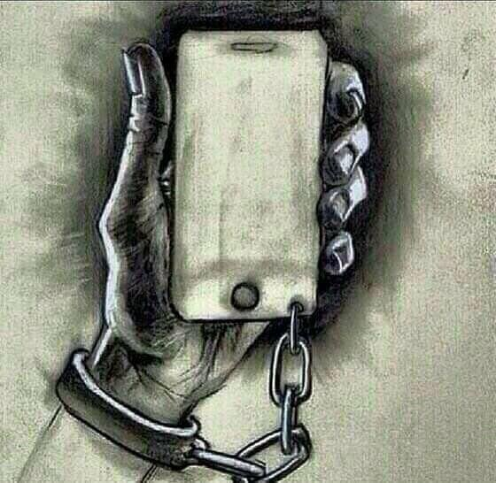

# Smart Phones / Cell Phones

### Dangers 
When cell phones were first created, they were touted as the perfect tool for emergencies.  If your car broke down somewhere, you were stranded, and it was too far to walk to get help, or you found yourself in a bad part of town (where walking wasn't a safe option) - call for help on a phone you carried with you.  The cell phone was meant to be a safety blanket for dangerous situations.

Today's modern Smart Phone looks nothing like the first several generations of cell phones.  Now, they are mini-computers, with touch screens, and more electronic gadgets than anyone could've ever imagined.  Oh the convenience of having a GPS, a digital camera, a health tracker, and the whole internet with you at all times!  You can remain in constant contact with your friends, family, and work.  You can know the news and weather for any area you are currently in (or simply curious about).  You can never really *get away* from it all - and that's even more true than you might realize.

### Cell Towers
There are cell towers nearly everywhere now.  When you have your cell phone with you, it is in constant communication with these towers (multiple at a time).  Your phone has a unique (IMEI) ID number, so that, if a phone call, or message arrives for you, the cell phone company knows which tower you are connected to, and directs that message, or call, to your phone.  Without your phone checking in with the closest tower/towers as you move around, or drive down the road, the cell phone company would have to send every single call, to every single tower, in order to find the one which it was intended for (a big waste of resources).

Since the cell phone company knows which cell phone tower your phone is connected to, anyone with access to that information can know (within a 45-mile radius) where you are physically located.  As I mentioned, cell towers are everywhere, and to provide better coverage, their signals overlap, and your cell phone is usually in contact with about 3 towers at any given time.  The connection with each tower will have a different signal strength with each tower, depending on which one you are closer to.  So, using the location of those towers, and the signal strength of each one to your cell phone (and a little math), your location can be narrowed down to about 20 feet.

### GPS
But, heh, who wants to go through all that trouble, and math when locating someone?  Our modern smart phones are equipped with GPS hardware, which communicates with the GPS (military owned) satellites, and provides your exact longitude and latitude (to anyone with access to your phone - physical, or remote).  By carrying around a smart phone, we are providing a beacon to anyone who would like to know where we are (or at least where our phone is) at any moment of every single day.  And, since it is a continuous beacon, the changing location can be mapped over time to provide someone with a map of every place you have gone.

### Digital Camera
The convenience of having a quality digital camera with us at all times usually means it's the only camera most of us own/use.  This camera (like all of the other electronic gadgets and apps on the phone) has access to all of the data/information from the other gadgets/apps.  When you take a picture, that picture contains the exact GPS co-ordinates where you were when you took that picture.  That information is then transferred with the picture when you send the picture to someone else, or post it on a social media site.  Now, that social media site knows where you were, at that exact moment.  But, that's pretty minor, as you can decide what gets posted, but, if you have the apps for those social media sites installed on your phone (for convenience), they too have access to all of the data from the other apps, and electronic gadgets.  This means, at any given time, Facebook, Instagram, Snapchat, etc. know where you are, what businesses (or destination spots) you are near, who you are with/near, how long you were there, if you were inside a business, and for how long.  All of this information is helpful for advertising, but it also informs anyone who is watching your social media account that you are not home, where you are, and provides an estimate as to the earliest you could return home.  All of this, without posting updates on your account, and giving away too much personal information (which is a huge mistake made by high percentage of the population today).

### Games
Those addictive little apps/games that allow us to pass the time when we are waiting in a long line, in traffic, commuting by train, etc. are not always *Free*.  They may not cost you anything to download, but the companies who develop those games are making money, and that money comes from selling your data.  Whether they use advertising or not, they are tracking your movements, looking through the information on your phone, and could even track your keystrokes (gaining access to logins/passwords).  Not all games are stealing information, but all of them are profiting from you in some way.  Best option: don't download games (or any FREE apps - other than ones which companies provide for banking, credit cards, airlines, etc.).  UPDATE (2/23/2021): DuckDuckGo has updated its browser/app for Android to block much of this tracking (See Further Reading below).

### Microphone
Well, a phone wouldn't be much good if it didn't have a microphone, and a speaker.  But, the microphone(s) in most Smart Phones do not restrict access to only the Phone app.  These microphones can be accessed by any of the apps on your phone, and can even be turned on remotely (without your knowledge).  A good example of this are the "Hey Google" and "Hey Siri" type apps.  If they are enabled, they are always listening.  This "feature" can, and should, be disabled on all phones.  But, what about the app that you aren't aware of, and is listening, doesn't show-up as an installed app on your phone, and therefore cannot be disabled?  A phone infected with something like that converts your phone into a spy device (either for a jealous boyfriend/spouse, a private investigator, a reporter, or your own government).  The idea that an ounce of prevention is worth a pound of cure applies here.  When you download/install apps, to try them out, and then you delete them, they may not fulling go away.  Your phone is now infected (like a virus), with something intended to track you, listen in on you, record your phone conversations, etc.  The best way to avoid this is to not install Apps of any kind, keep your phone locked and don't let it out of your sight - and keep Bluetooth disabled/off.

### Bluetooth
As mentioned in a previous class, Bluetooth is very insecure.  So insecure, that just having it on/enabled opens up your phone to attacks from people near you.  If you are on a busy train, shopping in a crowded area, or visiting anywhere that a person can be close to you, and go unnoticed, your phone can be hijacked and infected.  This means, an app can be installed onto your phone, without your consent or knowledge.  Some will disagree with this statement, as there are ways to restrict/limit access, etc., but there are always new vulnerabilities discovered.  The best/safest option is to simply keep Bluetooth turned off.

### Software Updates
As mentioned with your computer, make certain you allow your phone to update, install, patch, and reboot - as soon as you are notified by your cell phone company that an update is available.  If your phone is not current, you open yourself up to being hacked from any number of sources (remember, your phone is a computer, and when it's on WiFi, or 3G/4G/5G data, it's on the internet).

### Various Items
Because so many people have smart phones (more than those who own computers), and they always have them with them, they are the largest targets for hacking, spying, etc.  Please read the articles linked in the "Additional Reading" section to better educate, and protect, yourself.  I would also recommend leaving your cell phone at home when you attend any kind of rally, or large event.

<<-- [Previous Class](../Class6/README.md) -- [Next Class](../Class8/README.md) -->>

Additional Reading:
[Further_Reading](Further_reading.md)
