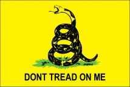

# Online Privacy/Security for the Modern Patriot

### Table of Contents

Class 1 - [Protecting Your Personal Computer Part 1 - Firewall](Class1/README.md)

Class 2 - [Protecting Your Personal Computer Part 1 - Browsers](Class2/README.md)

Class 3 - [Securing E-Mail Communication](Class3/README.md)

Class 4 - [Passwords and Password Managers](Class4/README.md)

Class 5 - [Backups](Class5/README.md)

Class 6 - [Public WiFi](Class6/README.md)

Class 7 - [Cell Phones/Smart Phones](Class7/README.md)

Class 8 - [Social Media (Facebook)](Class8/README.md)

Class 9 - [VPN](Class9/README.md)

Class 10 - [Biometrics](Class10/README.md)

Class 11 - [Financial](Class11/README.md)
